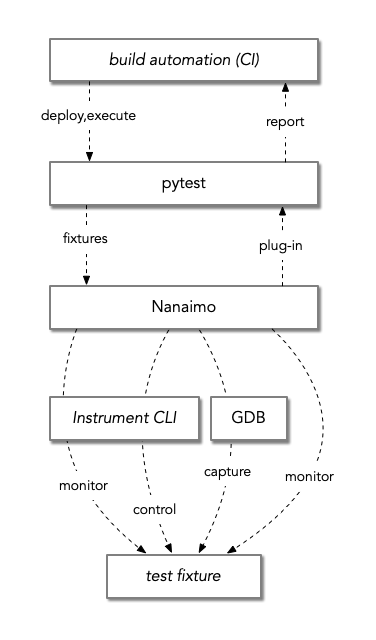
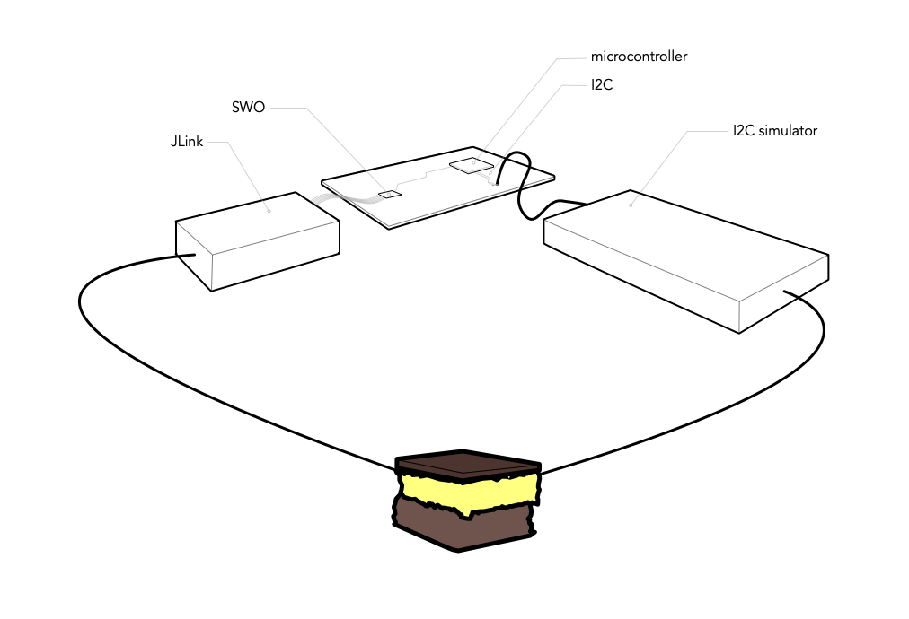

############################################
Nanaimo: Hardware-In-the-Loop Unit Testing
############################################

|badge_docs|_ |badge_build|_ |badge_github_license|_ |badge_pypi_support|_ |badge_pypi_version|_

.. Warning::
    Nanaimo is evolving rapidly right now. It is undergoing a change to focus on pytest
    integration and to introduce its own plugin architecture to allow test apparatuses
    and instruments to be easily contributed.

.. image:: docs/images/nanaimo.png
   :alt: A delicious Nanaimo bar

*It's the delicious custard between your unit test framework and your hardware test fixtures.*

Nanaimo is a set of utilities and plugins designed to enable real hardware test apparatuses
to be integrated with unit test frameworks like pytest. This can allow on-target tests to
run as part of continuous integration pipelines like `buildkite`_ or `jenkins`_.

.. image:: docs/images/pifarm.jpeg
   :alt: S32K eval boards attached to Rasberry PIs.

*Example of S32K dev boards attached to Raspberry PI CI workers running the `buildkite`_ agent
and using Nanaimo.*

Nanaimo is designed to enable testing of software-defined, physical components in isolation to
provide pre-integration verification of software interfaces and behavioural contracts. It adapts
asynchronous control and monitoring of these components to fit familiar testing idioms
(e.g. x-unit testing) using the popular python test framework, `pytest`_.

.. Note::
    `Nanaimo bars`_ are about the best things humans have ever invented. This
    test framework isn't as wonderful as the dessert but we hope it does bring
    a small smile to your face.

.. _`Nanaimo bars`: https://en.wikipedia.org/wiki/Nanaimo_bar
.. _`buildkite`: https://buildkite.com
.. _`jenkins`: https://jenkins.io/
.. _`pytest`: https://docs.pytest.org/en/latest/

.. |badge_docs| image:: https://readthedocs.org/projects/nanaimo/badge/?version=latest
    :alt: Documentation Status
.. _badge_docs: https://nanaimo.readthedocs.io/en/latest/?badge=latest

.. |badge_build| image:: https://badge.buildkite.com/0cf50056296ba113958b93f9058aad4cfffb8018062c044bf7.svg
    :alt: Build status
.. _badge_build: https://buildkite.com/friends-of-scott/nanaimo

.. |badge_github_license| image:: https://img.shields.io/badge/license-MIT-blue.svg
    :alt: MIT license
.. _badge_github_license: https://github.com/thirtytwobits/nanaimo/blob/master/LICENSE.rst

.. |badge_pypi_support| image:: https://img.shields.io/pypi/pyversions/nanaimo.svg
    :alt: Supported Python Versions
.. _badge_pypi_support: https://pypi.org/project/nanaimo/

.. |badge_pypi_version| image:: https://img.shields.io/pypi/v/nanaimo.svg
    :alt: Pypi Release Version
.. _badge_pypi_version: https://pypi.org/project/nanaimo/
