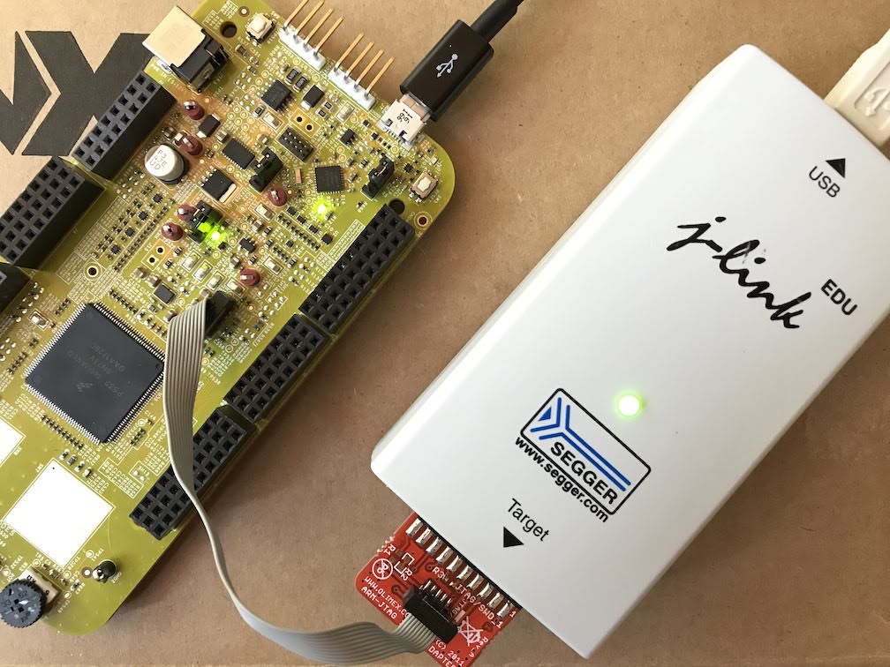

############################################
Nanaimo: Hardware-In-the-Loop CI Testing
############################################

*It's the delicious custard between your Continuous-Integration pipeline and your HIL test fixtures.*

.. Note::
    `Nanimo bars`_ are about the best things humans have ever invented. This
    test runner isn't as wonderful as the dessert but we hope it does bring
    a small smile to your face.

The :code:`nait` script is designed as a glue between CI automation like
`buildkite`_ or `jenkins`_ and a micro-controller test fixture physically
attached to a build host. This may evolve over time to be more generalized
supporting more advanced HIL apparatuses but for now we're stating small.

To use the current version of the :code:`nait` script simply produce `JLink Commander`_
scripts and hex files in one stage of your CI pipeline and deliver these
and nanaimo to a physical host your HIL rig is attached to.

*Example of a Segger* `JLink EDU`_ *attached to an NXP S32K144EVB being used by nanaimo*

Example::

    nait -vv \
     --port \
     /dev/serial/by-id/usb-Signoid_Kft._USB-UART_adapter_MACX98-if00-port0 \
     --port-speed 115200 \
     jlink_scripts/**

***********************************
JLink
***********************************

This version of nanaimo does require a segger JLink because it uses JLinkExe to upload
to and reset the test target.

.. Note::
    There is no plan to support OpenSDA as its mass storage upload solution
    does not have a portable API for resetting the target. For open source projects
    this seems like an ideal solution.

In the future we plan on adding support for `OpenOCD`_ and `pyOCD`_ both of which provide a
portable API to a large set of micro-controllers but JLink is the industry standard and the
`JLink EDU Mini`_ is an inexpensive probe (about $20 USD) with free software available for
linux, mac, and Windows that can be used for non-commercial purposes.

.. _`Nanimo bars`: https://en.wikipedia.org/wiki/Nanaimo_bar
.. _`buildkite`: https://buildkite.com
.. _`jenkins`: https://jenkins.io/
.. _`JLink Commander`: https://wiki.segger.com/J-Link_Commander
.. _`JLink EDU Mini`: https://www.segger.com/products/debug-probes/j-link/models/j-link-edu-mini/
.. _`JLink EDU`: https://www.segger.com/products/debug-probes/j-link/models/j-link-edu/
.. _`pyOCD`: https://github.com/mbedmicro/pyOCD
.. _`OpenOCD`: http://openocd.org/
