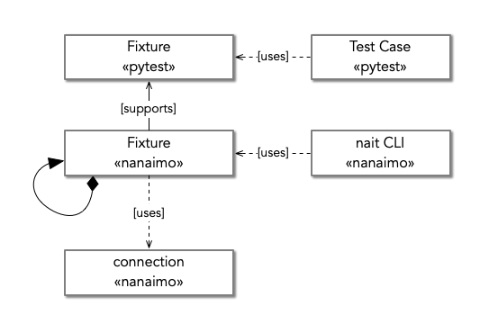
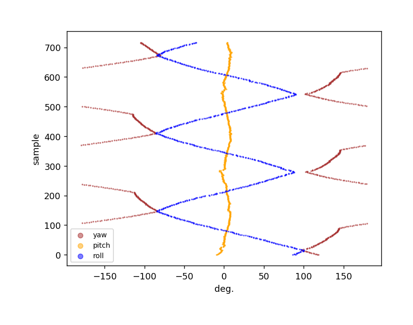

.. _guide:

###################################################################################################
Using Nanaimo
###################################################################################################

To illustrate how to use Nanaimo we are going to work with specific scenario. We'll be writing
tests to verify an IMU using a pan-tilt test rig.

.. _figure-pantilt:

.. figure:: static/images/pantilt.gif
   :alt: Example scenario using Nanaimo to test an IMU.

   Example scenario using Nanaimo to test an IMU.

Our test will run the following steps:

1. Upload the firmware using a serial bootloader.
2. Start the pan/tilt test rig,
3. Start capturing IMU readings.
4. Stop the pan/tilt test rig.
5. Validate the data.

As you read this document you might wonder if the amount of rigor is necessary given the sometimes
trivial nature of tests for components and sub-systems. One might be tempted to write a bash script or
a simpler python script with no formal structure.

.. admonition:: Don't normalize deviance....

    The authors of Nanaimo aver that the real-world is complicated and messy.
    When you include physical devices in software workflows you mix something that is inherently chaotic
    with something that assumes everything it does is absolutely deterministic. Dealing with
    edge cases and ensuring repeatability turns unstructured code into a complex mess. With unmanaged
    complexity comes unexpected behavior and when the unexpected behavior is tolerated a normalization of
    deviance sets in making the tests worse than nothing.

Nanaimo seeks to organize complexity within :class:`Fixtures <nanaimo.fixtures.Fixture>` presenting
a simplified API to test cases and allowing for a verification syntax that is concise and readable.
Furthermore, the architecture enables and encourages fixture reuse supporting
`DRY <https://en.wikipedia.org/wiki/Don't_repeat_yourself>`_ principles.

To summarize; as you read this guide keep the following goals in mind:

    **Encapsulate complexity in Fixtures. Write simple and clear test cases. Don't ignore failures.**

***************************************************************************************************
Taxonomy
***************************************************************************************************

Let's take a moment to review some important concepts and terms we'll use in our demonstration
below. There are two main things you will build using Nanaimo:

1. test cases
2. fixtures

.. _figure-taxonomy:

   The major concepts in Nanaimo.

We'll review both of these in the next two sections and will cover :ref:`nait` later in this
document.

Test Fixtures
===================================================================================================

.. _figure-utm:

   A test fixture used to hold material under test in a :abbr:`UTM (Universal Testing Machine)`
   [#one]_.

Mechanical, material, and electrical engineers may be confused by the term "fixture" as used by
software engineers. The former group uses the term to describe a physical adapter holding test
material in a precise and repeatable position within a test instrument. For software engineers the
term is similar but purely logical. For example, JUnit describes a fixture as something that ensures
"there is a well known and fixed environment in which tests are run so that results are repeatable
[#two]_." The term "environment" is the key here. Tests must be run in a well-known and repeatable
environment to be valid. The job of Nanaimo fixtures are to validate and adapt the software testing
environment to promote consistency and reliability.

.. note ::

    A quick note on "instruments" which is another taxonomic term found in Nanaimo. A Nanaimo
    instrument is simply a flavor of Fixture that either manipulates or measures a test subject.
    Like the :abbr:`UTM (Universal Testing Machine)` in :numref:`figure {number} <figure-utm>`,
    instrument fixtures sometimes need other fixtures which is why Nanaimo
    :class:`Fixtures <nanaimo.fixtures.Fixture>` are composable.

Test Cases
===================================================================================================

A test case is the xunit [#three]_ term for a single pytest test. For example:

.. _example-nanaimo-bar:

.. invisible-code-block: python

    import asyncio
    import nanaimo.builtin.nanaimo_bar
    from nanaimo.fixtures import FixtureManager

    loop = asyncio.get_event_loop()
    manager = FixtureManager(loop=loop)

.. code-block:: python

    import pytest
    from nanaimo import assert_success

    @pytest.mark.asyncio
    async def test_eating_dessert(nanaimo_bar):
        """
        Get a Nanaimo bar and eat it!
        """
        assert_success(await nanaimo_bar.gather()).eat()

.. invisible-code-block: python

    nanaimo_bar = nanaimo.builtin.nanaimo_bar.Fixture(manager)
    loop.run_until_complete(test_eating_dessert(nanaimo_bar))

In this example the "test case" is the ``test_eating_dessert`` method. Note the use of
:class:`nanaimo_bar <nanaimo.builtin.nanaimo_bar.Fixture>`.
This is a :class:`Nanaimo Fixture <nanaimo.fixtures.Fixture>` acting as a
`Pytest fixture <https://docs.pytest.org/en/latest/fixture.html>`_. If you are unfamiliar with Pytest
fixtures you should review their `documentation <https://docs.pytest.org/en/latest/fixture.html>`_ at this point.

Nanaimo defines HIL (Hardware-In-the-Loop) test cases as pytests that use
:class:`Fixtures <nanaimo.fixtures.Fixture>` to modify, manipulate, and observe hardware available in the test
environment. :numref:`Figure {number}<figure-test-phases>` shows the typical structure of this type of test case.
We'll discuss each phase in this section of the document and then provide a full example in a following section.

.. _figure-test-phases:

   Typical phases of a HIL unit test.

Phase 1. State Verification
---------------------------------------------------------------------------------------------------

The first thing most :abbr:`HIL (Hardware-In-the-Loop)` tests will do is to verify the state of the
required :class:`fixtures <nanaimo.fixtures.Fixture>`. Be careful with this phase and remember the
opening admonition, "Encapsulate complexity in fixtures. Write simple test cases. Don't ignore
failures". Well designed fixtures should provide internal consistency checks and fail when the
fixture is improperly used rather than requiring each test case to perform fixture setup. Still, not
all required state is generic so there are sometimes checks like, "Is this fixture already powered
up? If so reboot it." or "Is this instrument calibrated? If not then run the calibration procedure."
As both examples provided suggest, this phase is often an optimization used to skip lengthy steps
that may be unnecessary. Where initialization steps can take several minutes or more it becomes a
necessary optimization to enable a large number of small and simple tests to be written without
creating test suites that take hours to complete.

.. note ::

    Software unittest best practices generally posit that each test should be as narrow as possible
    ideally testing everything in the most independent and granular manner possible. Nanaimo seeks
    to enable this methodology when using hardware test apparatuses by allowing for highly intelligent
    :class:`Fixtures <nanaimo.fixtures.Fixture>` to optimize the test rig turn around time and to
    ensure all tests can begin in a known state. For those of you interested in writing more
    "sociable" tests keep an eye on `Issue 74 <https://github.com/thirtytwobits/nanaimo/issues/74>`_
    which would enable this pattern.

Phases 2, 3, & 4. Start/Acquire/Stop
---------------------------------------------------------------------------------------------------

The next three steps are sometimes carefully sequenced and sometimes run concurrently. The logic here
should be obvious: first you start the flow of data, you sample this data, and then you stop the flow
of data. Subtleties do arise especially when you need to capture data that is only available as part
of the startup sequence of a device (e.g. when you first power it on). When this data is required
you typically modify the sequence to be:

    start acquisition > start the fixture > stop the fixture > stop acquisition

You should prefer the form show in in :numref:`Figure {number}<figure-test-phases>` since startup
and shutdown are typically special cases.

Phase 5. Analyse
---------------------------------------------------------------------------------------------------

Now we get to the pure software part of the test. Nanaimo considers it good form to defer analysing
the data until after all fixtures have completed. This makes for two classes of failure:

1. Data acquisition failure
2. System performance failure

Data acquisition failures should always be treated as unknown failures which are bugs in the test
cases and/or test fixtures themselves. Well designed tests should be deterministic and you should always
expect to acquire the data you need to analyse a system under test. If you really want to argue the point
you can simply reclassify induced hardware failures as the data itself to understand our argument.
For example::

    # Acquire data
    assert_success(await my_fixture.gather(cmd='ping'))
    assert_success(await my_fixture.gather(cmd='halt'))
    with pytest.raises(DeviceUnavailableError):
        await my_fixture.gather(cmd='ping')

...where the "data" is "did the device become unreachable?" which is automatically analysed by
:func:`pytest.raises`.

It's more typical, however, to acquire a data-set like logs or sensor data that is then processed
comparing it to the required performance of the system under test. Failed assertions here are bugs
or regressions in the system itself. It is just this scenario that our example project will explore
so let's get started.

***************************************************************************************************
Setting up your Project
***************************************************************************************************

We won't go into detail on how to setup a Python project but we'll add a few things to make pytest
happy by default (none of this setup is specific to Nanaimo). Start by creating the
following directories and files::

    + myproject
    |
    |   + test
    |   |   test_stuff.py
    |   |   conftest.py
    |
    | tox.ini

In :file:`tox.ini` add the following::

    [pytest]
    log_cli = true
    log_cli_level = DEBUG
    log_format = %(asctime)s %(levelname)s %(name)s: %(message)s
    log_date_format = %Y-%m-%d %H:%M:%S

This will make any use of :class:`logging.Logger` log to the console when running tests.

Next setup a virtual environment. Again, this isn't a requirement for Nanaimo but it is a
best practice especially when playing around with a package like we're doing here::

    cd myproject
    virtualenv .pyenv
    source .pyenv/bin/activate

Finally, add Nanaimo::

    pip install nanaimo

If you want to run Nanaimo from source you can also do::

    pip install -e /path/to/nanaimo/

You may also want to use instruments that have other dependencies on the test environment but we'll
discuss this more in the section on writing your own :class:`Nanaimo Fixture <nanaimo.fixtures.Fixture>`.

Finally, let's add the "hello world" of Nanaimo, the nanaimo-bar fixture test, to :file:`test_stuff.py`.
See `the nanaimo-bar example <#example-nanaimo-bar>`_ above for this example. You should be able to run this test now::

    pytest

If you configured the tox pytest section for logging you'll see this output::

    -------------------------------------------------------- live log sessionstart -----------------------------------
    collected 1 item

    test/test_foo.py::test_eating_dessert
    ----------------------------------------------------------- live log setup ---------------------------------------
    2019-11-18 10:28:58 DEBUG asyncio: Using selector: KqueueSelector
    2019-11-18 10:28:58 DEBUG asyncio: Using selector: KqueueSelector
    ------------------------------------------------------------ live log call ---------------------------------------
    2019-11-18 10:28:58 INFO nanaimo_bar: don't forget to eat your dessert.
    2019-11-18 10:28:58 INFO nanaimo_bar: Nanaimo bars are yummy.
    PASSED

Now list your available pytest fixtures::

    pytest --fixtures

You'll see sections with titles like ``fixtures defined from nanaimo...``. For example::

    -------------------------- fixtures defined from nanaimo.instruments.bkprecision -----------------
    nanaimo_instr_bk_precision -- .pyenv/lib/python3.7/site-packages/nanaimo/instruments/bkprecision/__init__.py:314
        Provides a :class:`nanaimo.instruments.bkprecision.Series1900BUart` fixture to a pytest.
        This fixture controls a `BK Precision 1900B series power supply <https://bit.ly/34jeSz2>`_
        attached to the system via UART.

        :param pytest_request: The request object passed into the pytest fixture factory.
        :type pytest_request: _pytest.fixtures.FixtureRequest
        :return: A fixture providing control of a Series 1900 BK Precision power supply via UART.
        :rtype: nanaimo.instruments.bkprecision.Series1900BUart

If you do ``pytest --help`` you'll see the arguments listed for your Nanaimo fixtures. For example ::

    bkprecision:
    --bk-port=BK_PORT     The port the BK Precision power supply is connected
                            to. Set NANAIMO_BK_PORT in the environment to override
                            default.
    --bk-command=BK_COMMAND, --BC=BK_COMMAND
                            command
    --bk-command-timeout=BK_COMMAND_TIMEOUT
                            time out for individual commands. Set
                            NANAIMO_BK_COMMAND_TIMEOUT in the environment to
                            override default.
    --bk-target-voltage=BK_TARGET_VOLTAGE
                            The target voltage Set NANAIMO_BK_TARGET_VOLTAGE in
                            the environment to override default.
    --bk-target-voltage-threshold-rising=BK_TARGET_VOLTAGE_THRESHOLD_RISING
                            Voltage offset from the target voltage to trigger on
                            when the voltage is rising. Set
                            NANAIMO_BK_TARGET_VOLTAGE_THRESHOLD_RISING in the
                            environment to override default.
    --bk-target-voltage-threshold-falling=BK_TARGET_VOLTAGE_THRESHOLD_FALLING
                            Voltage offset from the target voltage to trigger on
                            when the voltage is falling. Set
                            NANAIMO_BK_TARGET_VOLTAGE_THRESHOLD_FALLING in the
                            environment to override default.

These are defined by the Nanaimo fixture itself in the
:meth:`on_visit_test_arguments <nanaimo.fixtures.Fixture.on_visit_test_arguments>` hook and can be
overridden using explicit commandline parameters to pytest or by passing in overrides in your pytests to
the :meth:`Fixture.gather() <nanaimo.fixtures.Fixture.gather>` method. The base configuration should come
from defaults either in ``etc/nanaimo.cfg`` or in a config file specified by ``--rcfile``.

We'll cover configuration in a later section. For now we'll pretend we configured everything already
so we can jump into the code and work back to the configuration.

***************************************************************************************************
Writing Pytests with Hardware-In-the-Loop
***************************************************************************************************

Let's get started with the simplest test to analyse but, perhaps, the most complex to automate; The
firmware update.

Firmware Update Pt.1
===================================================================================================

.. invisible-code-block: python

    from unittest.mock import MagicMock
    import asyncio
    import pytest
    import nanaimo

    loop = asyncio.get_event_loop()

.. code-block:: python

    from nanaimo import assert_success

    @pytest.mark.asyncio
    async def test_upload_firmware(nanaimo_arguments, nanaimo_cmd):
        """
        This test requires that a (fictitious) utility 'upload_firmware' is available in
        the environment and that it takes the arguments 'firmware path' and 'serial port'
        as its arguments.
        """
        upload_command = 'upload_firmware {imu_firmware} {imu_port}'.format(
                            **vars(nanaimo_arguments)
                         )
        assert_success(await nanaimo_cmd.gather(cmd_shell=upload_command))

.. invisible-code-block: python

    fake_nanaimo_arguments = nanaimo.Namespace()
    fake_nanaimo_arguments.imu_port = 'foo'
    fake_nanaimo_arguments.imu_firmware = 'bar'
    fake_nanaimo_cmd = MagicMock()

    fake_artifacts = MagicMock(spec="nanaimo.Artifacts")
    fake_artifacts.result_code = 0

    fake_gather = MagicMock(name='gather', return_value=fake_artifacts)
    fake_gather_co = asyncio.coroutine(fake_gather)
    fake_nanaimo_cmd.gather = fake_gather_co

    loop.run_until_complete(test_upload_firmware(fake_nanaimo_arguments, fake_nanaimo_cmd))

    fake_gather.assert_called_with(cmd_shell='upload_firmware bar foo')

So everything that is interesting (read: complex) about this test is hidden down in our fictitious
"upload_firmware" program. Our earlier assertion that this was difficult to automate seems bogus.
Regardless we've verified that the device is present and can have a new firmware loaded on it. We'll
come back to this test later to explain why we warned about the complexity. For now
let's move forward to capturing and analysing some IMU data.

IMU Data Test
===================================================================================================

This test will use the following Nanaimo fixtures:

+---------------------------+---------------------------------------------------------------------+
| pytest fixture name       | Role                                                                |
+===========================+=====================================================================+
| nanaimo_serial            | Attached to the IMU to capture data.                                |
+---------------------------+---------------------------------------------------------------------+
| nanaimo_serial_watch      | Attached to the IMU validate that it started up normally.           |
+---------------------------+---------------------------------------------------------------------+
| nanaimo_yepkit            | USB3 hub with controllable power output.                            |
+---------------------------+---------------------------------------------------------------------+
| nanaimo_gather            | Run the serial watcher at the same time we turn on the IMU power    |
+---------------------------+---------------------------------------------------------------------+

.. invisible-code-block: python

    from unittest.mock import MagicMock
    import asyncio
    import pytest
    import nanaimo

    loop = asyncio.get_event_loop()

.. code-block:: python

    from nanaimo import assert_success

    @pytest.mark.asyncio
    async def test_imu(nanaimo_arguments, nanaimo_serial_watch, nanaimo_serial, nanaimo_yepkit, nanaimo_gather):
        """
        A test that verifies that our IMU is returning sensible data.
        """

        yepkit_port_for_pantilt = nanaimo_arguments.yep_pantilt_port
        yepkit_port_for_imu = nanaimo_arguments.yep_imu_port

        # Enable the IMU and ensure we see the expected "I'm up" message
        coroutines = [
            nanaimo_serial_watch.gather(lw_pattern=r"I'm\s+up"),
            nanaimo_yepkit.gather(yep_port=yepkit_port_for_imu, yep_command='u')
        ]

        assert_success(await nanaimo_gather.gather(gather_coroutine=coroutines))

        # Start the pan-tilt fixture.
        assert_success(await nanaimo_yepkit.gather(yep_port=yepkit_port_for_pantilt,
                                                   yep_command='u'))

        # We're going to wait 3-seconds to let the IMU warm up a bit, to let the
        # pan-tilt hardware to work out any resonances from startup impulses, and
        # to let any filters flatten out in the IMU.
        await nanaimo_gather.countdown_sleep(3)

        # We'll capture 10-seconds of data.
        artifacts = assert_success(await nanaimo_serial.gather(ser_memory_capture=10))

        # Shutdown the pan-tilt fixture and the IMU.
        assert_success(await nanaimo_yepkit.gather(yep_port=[yepkit_port_for_pantilt,
                                                             yepkit_port_for_imu],
                                                   yep_command='d'))

        # #####################################################################
        #  At this point we're done acquiring data. Next use this data to
        #  evaluate the performance of the IMU
        # #####################################################################

        # for ypr_tuple in artifacts.data

.. invisible-code-block: python

    from nanaimo.builtin import nanaimo_gather
    from nanaimo.fixtures import FixtureManager
    from nanaimo.config import ArgumentDefaults

    fixture_mgr = FixtureManager(loop=loop)

    dummy_nanaimo_arguments = nanaimo.Namespace(defaults=ArgumentDefaults())

    fake_nanaimo_serial_watch = MagicMock()
    fake_nanaimo_serial = MagicMock()
    fake_nanaimo_yepkit = MagicMock()

    dummy_artifacts = nanaimo.Artifacts()

    fake_gather_serial_watcher = MagicMock(name='gather', return_value=dummy_artifacts)
    fake_gather_serial_watcher_co = asyncio.coroutine(fake_gather_serial_watcher)

    fake_gather_serial = MagicMock(name='gather', return_value=dummy_artifacts)
    fake_gather_serial_co = asyncio.coroutine(fake_gather_serial)

    fake_gather_yepkit = MagicMock(name='gather', return_value=dummy_artifacts)
    fake_gather_yepkit_co = asyncio.coroutine(fake_gather_yepkit)

    fake_nanaimo_serial_watch.gather = fake_gather_serial_watcher_co
    fake_nanaimo_serial.gather = fake_gather_serial_co
    fake_nanaimo_yepkit.gather = fake_gather_yepkit_co

    loop.run_until_complete(test_imu(dummy_nanaimo_arguments,
                                     fake_nanaimo_serial_watch,
                                     fake_nanaimo_serial,
                                     fake_nanaimo_yepkit,
                                     nanaimo_gather.Fixture(fixture_mgr)))

    fake_gather_yepkit.assert_called_with(yep_port=['1', '2'], yep_command='d')

We're going to end this example here to avoid digressing into a discussion on analysing sensor data
and stay focused on the mechanics of Nanaimo. Before we move on though we offer
:numref:`Figure {number}<figure-imu-plot>` which is real data captured from the test rig shown in
:numref:`Figure {number}<figure-pantilt>`. Seeing this data one can see how imprecise the test rig
is but also that there are obvious strategies for sanity testing this data-set.

.. _figure-imu-plot:

   Plot of Yaw Pitch and Roll data acquired as part of the example test.

Firmware Update Pt.2
===================================================================================================

Let's revisit the firmware update test again. The complexity we hinted at arises from two things:

1. Making sure the firmware is loaded before each test.
2. Reducing test time and decreasing part wear by skipping the firmware update if the right firmware
   was already on the device.

Item 2 is sometimes handled automatically by the underlying tooling (for example, Segger
JLink is very good at eliding unnecessary writes) and the amount of time it takes to "upload" or
"flash" a firmware to a target device varies significantly depending on the device's capabilities,
the size of the binary, the efficiency of the programmer, and upload protocol in use. Where the test
itself must contain logic to avoid unnecessary programming we need to make some decisions. We either
need to check and potentially update the firmware before each test or we need to be sure we always
run the firmware update test first and successfully.

As Item 2 details, before we can make any decisions on how to ensure we have the correct firmware we
need a way to check this. Again, the underlying tool can often handle this for us automatically but
for our example we'll have to ask:

.. invisible-code-block: python

    from unittest.mock import MagicMock
    import asyncio
    import pytest
    import functools
    import nanaimo
    import logging

    loop = asyncio.get_event_loop()

.. code-block:: python

    from nanaimo import assert_success

    @pytest.mark.asyncio
    async def test_upload_firmware_if_needed(nanaimo_arguments, nanaimo_cmd, nanaimo_log):
        """
        We'll expand our use of the fictitious 'upload_firmware' binary to suppose it
        has a '--query' parameter that returns the version of the firmware found on the
        device.
        """

        class VersionFilter(logging.Filter):
            '''
            Very naive filter that finds and stores only the structured version number
            found in the subprocess output.
            '''

            def __init__(self):
                self.result = None

            def filter(self, record: logging.LogRecord) -> bool:
                if record.getMessage().startswith('version='):
                    self.result = [int(x) for x in record.getMessage()[8:].split('.')]

        query_command = 'upload_firmware --query-version {imu_port}'.format(
                            **vars(nanaimo_arguments)
                         )
        upload_command = 'upload_firmware {imu_firmware} {imu_port}'.format(
                            **vars(nanaimo_arguments)
                         )

        nanaimo_cmd.stdout_filter = VersionFilter()
        assert_success(await nanaimo_cmd.gather(cmd_shell=query_command))

        version_triplet = nanaimo_cmd.stdout_filter.result

        # We'll be reusing this fixture so let's unset the stdout filter.
        nanaimo_cmd.stdout_filter = None

        if nanaimo_arguments.imu_firmware_version_major != version_triplet[0] or \
           nanaimo_arguments.imu_firmware_version_minor != version_triplet[1] or \
           nanaimo_arguments.imu_firmware_version_patch != version_triplet[2]:

            nanaimo_log.info('Required firmware version %d.%d.%d - Found %d.%d.%d',
                nanaimo_arguments.imu_firmware_version_major,
                nanaimo_arguments.imu_firmware_version_minor,
                nanaimo_arguments.imu_firmware_version_patch,
                version_triplet[0],
                version_triplet[1],
                version_triplet[2]
            )

            # Okay, NOW we know we need to upload. So do that.
            assert_success(await nanaimo_cmd.gather(cmd_shell=upload_command))

        else:

            nanaimo_log.info('Required firmware version %d.%d.%d Found. Skipping upload.',
                nanaimo_arguments.imu_firmware_version_major,
                nanaimo_arguments.imu_firmware_version_minor,
                nanaimo_arguments.imu_firmware_version_patch
            )

.. invisible-code-block: python

    fake_nanaimo_arguments = nanaimo.Namespace()
    fake_nanaimo_arguments.imu_port = 'foo'
    fake_nanaimo_arguments.imu_firmware = 'bar'
    fake_nanaimo_arguments.imu_firmware_version_major = 1
    fake_nanaimo_arguments.imu_firmware_version_minor = 2
    fake_nanaimo_arguments.imu_firmware_version_patch = 9
    fake_nanaimo_log = logging.getLogger(__name__)

    fake_nanaimo_cmd = MagicMock()

    fake_artifacts = MagicMock(spec="nanaimo.Artifacts")
    fake_artifacts.result_code = 0

    def fake_gather(fake_nanaimo_cmd, cmd_shell):
        if fake_nanaimo_cmd.stdout_filter is not None:
            record = logging.LogRecord('foo', 100, '', 0, 'version=1.2.8', [], None)
            fake_nanaimo_cmd.stdout_filter.filter(record)
        return fake_artifacts

    fake_gather = MagicMock(name='gather',
                            side_effect=functools.partial(fake_gather, fake_nanaimo_cmd))

    fake_gather_co = asyncio.coroutine(fake_gather)
    fake_nanaimo_cmd.gather = fake_gather_co

    loop.run_until_complete(test_upload_firmware_if_needed(fake_nanaimo_arguments,
                                                           fake_nanaimo_cmd,
                                                           fake_nanaimo_log))

So, there are a few problems with our ``test_upload_firmware_if_needed`` method above. First,
it's a lot of logic that isn't actually testing anything and there's no guarantee that this test
will run before any other test that is implicitly testing a specific firmware version. Remembering
the first part of our mantra "Encapsulate complexity in Fixtures" it looks like we need a fixture.

While you can create a fixture as part of a redistributable python package we're going to keep it
simple and just use the :file:`conftest.py` [#four]_ file we created next to our :file:`test_stuff.py`
file. Open that file in your favorite editor and add the following:

.. note ::

    Unfortunately, this example won't actually do anything because your system doesn't have
    an "upload_firmware" binary that behaves as our tests assume. You could create a dummy program or
    you can modify the shell command to use a programmer that you do have available on your system.

.. code-block:: python

    #
    # conftest.py
    #

    import logging
    import pytest
    import typing
    import sys
    from unittest.mock import MagicMock

    import nanaimo
    import nanaimo.config
    import nanaimo.fixtures
    import nanaimo.pytest
    import nanaimo.pytest.plugin
    from nanaimo.fixtures import FixtureManager
    from nanaimo import assert_success

    class FirmwareUpdateFixture(nanaimo.builtin.nanaimo_cmd.Fixture):

        fixture_name = 'firmware_update'
        argument_prefix = 'fwr'

        class VersionFilter(logging.Filter):
            '''
            Very naive filter that finds and stores only the structured version number
            found in the subprocess output.
            '''

            def __init__(self):
                self.result = None

            def filter(self, record: logging.LogRecord) -> bool:
                if record.getMessage().startswith('version='):
                    self.result = [int(x) for x in record.getMessage()[8:].split('.')]
                return True

        query_command = 'upload_firmware --query-version {port}'
        upload_command = 'upload_firmware {firmware} {port}'

        def __init__(self,
                    manager: 'FixtureManager',
                    args: typing.Optional[nanaimo.Namespace] = None,
                    **kwargs: typing.Any):
            super().__init__(manager, args, **kwargs)
            self._cmd = nanaimo.builtin.nanaimo_cmd.Fixture(manager, args, **kwargs)

        @classmethod
        def on_visit_test_arguments(cls, arguments: nanaimo.Arguments) -> None:
            nanaimo.builtin.nanaimo_cmd.Fixture.on_visit_test_arguments(arguments)
            arguments.add_argument('force', action='store_true', help='Always upload firmware.')
            arguments.add_argument('firmware_version_major', type=int, help='Required major firmware version.')
            arguments.add_argument('firmware_version_minor', type=int, help='Required minor firmware version.')
            arguments.add_argument('firmware_version_patch', type=int, help='Required patch firmware version.')
            arguments.add_argument('port', help='The serial port to provide to upload_firmware')
            arguments.add_argument('firmware', help='The firmware file to upload.')

        async def on_gather(self, args: nanaimo.Namespace) -> nanaimo.Artifacts:

            if args.fwr_force:

                self._logger.info('Forced firmware upload...')

                # We are forcing the upload to be sure it works regardless of what exists on the
                # target right now.
                return await self._do_upload(args)

            else:
                version_triplet = await self._query_version(args)

                if args.fwr_firmware_version_major != version_triplet[0] or \
                        args.fwr_firmware_version_minor != version_triplet[1] or \
                        args.fwr_firmware_version_patch != version_triplet[2]:

                    self._logger.info('Required firmware version %d.%d.%d - Found %d.%d.%d',
                                    args.fwr_firmware_version_major,
                                    args.fwr_firmware_version_minor,
                                    args.fwr_firmware_version_patch,
                                    version_triplet[0],
                                    version_triplet[1],
                                    version_triplet[2]
                                    )

                    # Okay, NOW we know we need to upload. So do that.
                    return await self._do_upload(args)

                else:

                    self._logger.info('Required firmware version %d.%d.%d Found. Skipping upload.',
                                    args.fwr_firmware_version_major,
                                    args.fwr_firmware_version_minor,
                                    args.fwr_firmware_version_patch
                                    )

        async def _query_version(self, args: nanaimo.Namespace) -> typing.Tuple[float, float, float]:
            self._cmd.stdout_filter = self.VersionFilter()

            try:
                query = self.query_command.format(port=args.fwr_port)
                await self._cmd.gather(cmd_shell=query)

                return self._cmd.stdout_filter.result

            finally:
                self._cmd.stdout_filter = None

        async def _do_upload(self, args: nanaimo.Namespace) -> nanaimo.Artifacts:
            upload = self.upload_command.format(firmware=args.fwr_firmware,
                                                port=args.fwr_port)
            return await self._cmd.gather(cmd_shell=upload)

    @pytest.fixture
    def my_firmware_update(request: typing.Any) -> nanaimo.fixtures.Fixture:
        return nanaimo.pytest.plugin.create_pytest_fixture(request, FirmwareUpdateFixture)

.. invisible-code-block: python

    import asyncio

    loop = asyncio.get_event_loop()

    fake_nanaimo_arguments = nanaimo.Namespace()
    fake_nanaimo_arguments.fwr_port = 'foo'
    fake_nanaimo_arguments.fwr_firmware = 'bar'
    fake_nanaimo_arguments.fwr_firmware_version_major = 1
    fake_nanaimo_arguments.fwr_firmware_version_minor = 2
    fake_nanaimo_arguments.fwr_firmware_version_patch = 9

    fake_nanaimo_cmd = MagicMock()

    fake_artifacts = MagicMock(spec="nanaimo.Artifacts")
    fake_artifacts.result_code = 0

    def fake_gather(fake_nanaimo_cmd, cmd_shell):
        if fake_nanaimo_cmd.stdout_filter is not None:
            record = logging.LogRecord('foo', 100, '', 0, 'version=1.2.8', [], None)
            fake_nanaimo_cmd.stdout_filter.filter(record)
        return fake_artifacts

    fake_gather = MagicMock(name='gather',
                            side_effect=functools.partial(fake_gather, fake_nanaimo_cmd))

    fake_gather_co = asyncio.coroutine(fake_gather)
    fake_nanaimo_cmd.gather = fake_gather_co

    update = FirmwareUpdateFixture(FixtureManager(loop=loop), fake_nanaimo_arguments)
    update._cmd = fake_nanaimo_cmd

    loop.run_until_complete(update.gather(fwr_force=True))

Now go back to your test file and change the ``test_upload_firmware_if_needed`` method to::

    from nanaimo import assert_success

    @pytest.mark.asyncio
    async def test_upload_firmware(my_firmware_update):
        assert_success(await my_firmware_update.gather(fwr_force=True))

This is now a test that always runs to verify that the firmware update works. For all other tests we can
reuse this fixture to ensure we are testing with the current firmware. For example::

    @pytest.mark.asyncio
    async def test_imu(my_firmware_update,
                       nanaimo_arguments,
                       nanaimo_serial_watch,
                       nanaimo_serial,
                       nanaimo_yepkit,
                       nanaimo_gather):
        """
        A test that verifies that our IMU is returning sensible data.
        """

        assert_success(await my_firmware_update.gather())

        yepkit_port_for_pantilt = nanaimo_arguments.yep_pantilt_port
        yepkit_port_for_imu = nanaimo_arguments.yep_imu_port
        ...

Configuration
===================================================================================================

Finally, let's look at how the configuration works. In our example so far we've assumed several
properties were available in the fixture arguments. There are several ways to provide these values.
For a Linux-like system that is dedicated as a test host you may want to create an
:file:`/etc/nanaimo.cfg` file. For user overrides you can provide :file:`~/nanaimo.cfg`. For your
test you can supply these arguments either in :file:`setup.cfg` or in :file:`tox.ini`. For example::

    # In tox.ini

    [nanaimo]
    fwr_firmware_version_major = 2
    fwr_firmware_version_minor = 1
    fwr_firmware_version_patch = 0
    fwr_port = /dev/serial/by-id/usb-some-uart-port0
    fwr_firmware = myfirmware.bin

A few things to note about Nanaimo ini syntax; first it uses :class:`configparser.ConfigParser` to parse
the configuration files and it also uses :class:`configparser.ExtendedInterpolation` to allow referencing
other nanaimo ini sections. Finally, underscores are treated as namespaces so the following tox configuration
is equivalent to the previous example::

    # In tox.ini

    [nanaimo:fwr]
    port = /dev/serial/by-id/usb-some-uart-port0
    firmware = myfirmware.bin

    [nanaimo:fwr_firmware_version]
    major = 2
    minor = 1
    patch = 0

Also note in our previous fixture example that the prefix ``fwr`` was omitted from the argument names::

    @classmethod
    def on_visit_test_arguments(cls, arguments: nanaimo.Arguments) -> None:
        nanaimo.builtin.nanaimo_cmd.Fixture.on_visit_test_arguments(arguments)
        arguments.add_argument('force', action='store_true', help='Always upload firmware.')
        arguments.add_argument('firmware_version_major', type=int, help='Required major firmware version.')
        arguments.add_argument('firmware_version_minor', type=int, help='Required minor firmware version.')
        arguments.add_argument('firmware_version_patch', type=int, help='Required patch firmware version.')
        arguments.add_argument('port', help='The serial port to provide to upload_firmware')
        arguments.add_argument('firmware', help='The firmware file to upload.')

This is done on purpose. Nanaimo will prepend the prefix based on the value of ``argument_prefix``
for a given fixture. What's useful about this is it allows fixtures to be composed out of other fixtures.
For example, if you compose ``MyOtherUpdateFixture`` fixture out of ``MyOtherUpdateFixture`` like this::

    class MyOtherUpdateFixture(FirmwareUpdateFixture):
        ...
        argument_prefix = 'mou'
        ...
        @classmethod
        def on_visit_test_arguments(cls, arguments: nanaimo.Arguments) -> None:
            super().on_visit_test_arguments(arguments)

...then your new fixture's arguments will be prefixed with `mou` and won't conflict with `fwr` arguments.
If you aggregate in a fixture instead (like ``FirmwareUpdateFixture`` does with ``nanaimo_cmd.Fixture``
then the arguments will get their prefix from the aggregate.

***************************************************************************************************
:ref:`nait`
***************************************************************************************************

.. note ::

    **TODO** Finish this section on using ``nait``.

---------------------------------------------------------------------------------------------------

.. [#one] Wikipedia Article, "Test Fixture": https://en.wikipedia.org/wiki/Test_fixture
.. [#two] The `JUnit 4 wiki <https://github.com/junit-team/junit4/wiki/Test-fixtures>`_
.. [#three] Wikipedia Article, "xUnit": https://en.wikipedia.org/wiki/XUnit
.. [#four] Conftest.py in pytest docs: https://docs.pytest.org/en/latest/fixture.html#conftest-py
